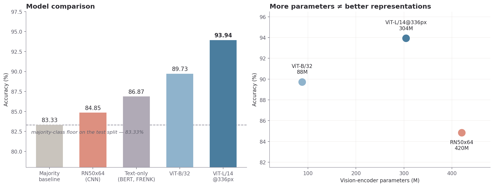

# PrideShield

**Multimodal detection of anti-LGBTQ+ hate speech in internet memes.**

Memes defeat text-only moderation: the image is often benign, the caption is often benign, and the
hostility exists only in their combination. PrideShield fuses **CLIP** visual and text embeddings
into an MLP classifier, benchmarks three vision encoders under identical conditions, and evaluates
against a text-only transformer baseline.

**Result: 93.94% accuracy / 0.9030 ROC-AUC** — roughly **7 points above a text-only transformer**
and **10.6 points above the majority-class floor** on a hand-built, hand-labeled corpus.

<p align="center">
  
</p>

📖 **[Read the full technical documentation →](https://vermillion-1.github.io/PrideShield/)**  
<sub>Dataset construction, preprocessing, CLIP architecture, encoder comparison and evaluation — with diagrams and dataset statistics.</sub>

> *Archived research code, developed July 2024 – May 2025 as an undergraduate major project at
> JUIT. Read-only: the dataset is not publicly available and notebooks contain Colab-specific paths.
> See [`docs/05_future_work.md`](docs/05_future_work.md) for how this would be built today.*
>
> *Note on git history: commits are dated September 2026 because the history was rewritten then to
> remove scraped dataset content from stored notebook outputs. Dependencies are pinned to the
> versions the work was developed against and are intentionally not updated.*

---

## Results

**Best configuration — CLIP `ViT-L/14@336px` → MLP head**, selected by a 30-trial Optuna study
(AdamW, lr 0.01, weight decay 0, dropout 0.4, LeakyReLU, Focal Loss, layers `[512, 256, 128]`):

| Metric | Score |
|---|---|
| **Accuracy** | **93.94%** |
| Precision | 96.91% |
| Recall | 94.58% |
| F1 | 95.73% |
| ROC-AUC | 0.9030 |

**Encoder comparison** — all three run through the same head, search procedure and splits:

| Encoder | Embedding dim | Vision params | Accuracy |
|---|---|---|---|
| `RN50x64` (CNN) | 1024 | 420.4M | 84.85% |
| `ViT-B/32` | 512 | 87.8M | 89.73% |
| **`ViT-L/14@336px`** | 768 | 304.3M | **93.94%** |

<sub>Parameter counts are the CLIP vision tower only, computed with `open_clip`; full model sizes
including the text tower are 623.3M, 151.3M and 427.9M.</sub>

Reference points: majority-class floor on the test split **83.33%** (165 of 198 examples are
positive) · text-only transformer **~86.87%**.

### Two findings worth stating

**1. More parameters did not mean better representations.** `RN50x64` has the most parameters
(420.4M) and the widest embedding (1024-d) — and finished **last**, ~5 points below a ViT with
roughly a fifth of its parameters. For a task requiring the model to relate overlaid text to image
semantics, ViT's global self-attention outperformed convolutional inductive bias regardless of
capacity.

**2. The optimal class-imbalance strategy depended on the encoder.** Rather than assuming Focal Loss
suits imbalanced data, the loss function was made a *search parameter*. Optuna selected **Focal
Loss** for `ViT-L/14@336px` but **class-weighted CrossEntropy** for `ViT-B/32` — an interaction a
fixed choice would have concealed.

---

## Technical Work

### Dataset — built from scratch, no budget

No public corpus of anti-LGBTQ+ memes existed, and the project had **no funding** for paid APIs,
annotation services, or compute. The corpus was built end-to-end:

```
6 collection methods attempted (3 failed)
        │
        ▼
  4 sources          ──►  perceptual-hash dedup  ──►  1,667 hand-labeled
   (Reddit, 4chan,        1,696 images / 476 MB       (2 independent annotators,
    DDG/Bing/Google)                                   86.9% agreement)
                                                              │
                                                              ▼
                                                     1,320 final examples
                                                     70/15/15 · 80.9%/19.1%
```

**Collection methods — including what failed:**

| Method | Status | Why |
|---|---|---|
| Twitter/X via `twint` | ❌ | Broken by 2023 API changes; official API paid-only → X dropped as a source |
| ScraperAPI (commercial) | ❌ | Never funded — the prototype still contains `'YOUR API KEY'` |
| `requests` + BeautifulSoup on image search | ❌ | Results are JS-rendered; returns an empty shell |
| Reddit PRAW / asyncpraw | ✅ | Free tier, rate-limited; async variant added for throughput |
| 4chan public JSON API | ✅ | No auth required; highest hostile-content density |
| Selenium → DDG/Bing/Google Images | ✅ | The only route to JS-rendered image results |

The HTTP-scraping failure is what forced browser automation — Selenium drives a real browser, waits
for render, scrolls to trigger lazy loading, then scrapes the live DOM. It worked, and it was the
most maintenance-heavy component in the pipeline.

→ [`docs/01_dataset.md`](docs/01_dataset.md)

### Preprocessing — the quality-control layer

**Perceptual-hash deduplication** was a correctness requirement, not housekeeping. The same viral
memes appear across every platform; duplicates spanning a train/test boundary leak the test set and
make reported accuracy meaningless. `imagededup` (pHash) catches re-encoded, cropped and watermarked
variants that exact hashing misses.

**OCR was the largest quality bottleneck.** Meme text is stylized, low-contrast, and spread across
panels with no reading order. Since the caption is half the multimodal signal — and CLIP embeds
nonsense confidently — bad OCR produces a *confidently wrong* text embedding. Two correction stages
were layered on EasyOCR output: a **T5 sequence-to-sequence corrector** for structural damage
(merged words, lost spacing), then **Levenshtein/spellchecker repair** for residual character errors.
The edit-distance stage doubles as partial defense against deliberate misspelling used to evade
keyword filters.

→ [`docs/02_preprocessing.md`](docs/02_preprocessing.md)

### Modeling — frozen encoders, searched head

Free-tier compute ruled out fine-tuning a 304M-parameter encoder, fixing the architecture as
**frozen CLIP + small trainable head**. The constraint had an upside: embeddings compute once and
cache, after which every experiment trains in seconds — which is what made a three-encoder
comparison and a 30-trial search affordable at all.

```
image ──► CLIP vision encoder (frozen) ──► L2-norm ─┐
                                                     ├─► concat ─► MLP ─► {hateful, not}
OCR text ► CLIP text encoder  (frozen) ──► L2-norm ─┘
```

```
Linear(2·embed_dim, 512) → LeakyReLU → Dropout(0.4)
    → Linear(512, 256)   → LeakyReLU → Dropout(0.4)
    → Linear(256, 128)   → LeakyReLU → Dropout(0.4) → Linear(128, 2)
```
<sub>The searched best configuration for `ViT-L/14@336px`. `src/models.py` takes the hidden widths
as a parameter; its constructor defaults are not this configuration.</sub>

**Focal Loss** was implemented from scratch (`(1 − p_t)^γ` down-weighting of easy examples) rather
than imported, and offered to the search alongside class-weighted CrossEntropy.

Reusable components are extracted to [`src/`](src/) — [`losses.py`](src/losses.py),
[`models.py`](src/models.py).

**Architectures tried and rejected:** transformer-over-tabular-features, MLP+BatchNorm,
MLP+L2+early-stopping, deeper heads. None beat the simple searched MLP — with ~924 training
examples there was nothing for the extra capacity to learn. Every failed experiment pointed at
dataset size, not architecture.

→ [`docs/03_modeling.md`](docs/03_modeling.md) · [`docs/04_evaluation.md`](docs/04_evaluation.md)

---

## Repository Structure

```
PrideShield/
├── notebooks/
│   ├── 01_data_collection/     # 5 notebooks — scraping across 4 platforms
│   ├── 02_preprocessing/       # 7 notebooks — dedup, OCR, correction, merge
│   ├── 03_modeling/            # 5 notebooks — baseline, CLIP+MLP, encoder comparison
│   └── utils/
├── src/                        # extracted components (FocalLoss, MultimodalMLP)
├── docs/                       # per-stage technical write-ups + diagrams + figures
├── requirements.txt            # pinned
├── CITATION.cff
└── LICENSE                     # Apache-2.0
```

## Documentation

| Document | Covers |
|---|---|
| [`01_dataset.md`](docs/01_dataset.md) | Collection methods (incl. failures), dedup, splits, class balance |
| [`02_preprocessing.md`](docs/02_preprocessing.md) | pHash dedup, OCR extraction, T5 + Levenshtein correction |
| [`03_modeling.md`](docs/03_modeling.md) | Baseline, architecture, encoder comparison, Optuna, rejected variants |
| [`04_evaluation.md`](docs/04_evaluation.md) | Results, how to read them, what was not measured |
| [`05_future_work.md`](docs/05_future_work.md) | Current SOTA (VLMs, PEFT, benchmarks) and the rebuild plan |

Design diagrams (data-flow, class, ER, use-case) with editable `.drawio` sources:
[`docs/diagrams/`](docs/diagrams/).

## Getting Started

```bash
git clone https://github.com/Vermillion-1/PrideShield.git
cd PrideShield
python -m venv .venv && source .venv/bin/activate
pip install -r requirements.txt
```

Notebooks are read-only references — they use Colab paths (`/content/…`, Drive mounts) and the
dataset is not distributed. `src/` is importable and runnable. Scrapers require your own Reddit API
credentials; `.gitignore` covers `praw.ini` and `.env`.

## Dataset Availability

**The dataset is not publicly available.** Release was not authorized by the supervising faculty at
JUIT, and independently, publishing a corpus of scraped hate speech targeting a marginalized
community would be the wrong thing to do — it would redistribute that material to anyone browsing
the repo and conflict with the source platforms' terms of service. **Please do not request it.**

Everything needed to rebuild an equivalent corpus is documented in
[`docs/01_dataset.md`](docs/01_dataset.md) and [`docs/02_preprocessing.md`](docs/02_preprocessing.md).

**If you build on this work:** treat the classifier as a triage aid, not an adjudicator. False
positives on reclaimed in-group language are the dominant failure mode for this class of model, and
silencing the community the system exists to protect is a worse error than missing a slur.

---

## Note

<sub>

**Scope.** An undergraduate project built on free-tier compute, using a self-collected and
self-labeled corpus of ~1,320 examples. The results hold within that scope.

**Reading the metrics.** The test split is 165 positive / 33 negative, so the majority-class floor
there is 83.33% — not the corpus-level 80.9%. Precision, recall and F1 are positive-class figures;
macro averages are lower. ROC-AUC (0.9030) is the most robust single number here.

**Splits are not stratified.** Class balance drifts from 79.76% positive in train to 83.33% in test.
Stratified splitting would have cost nothing and should have been used.

**The reported metrics do not fully reconcile.** On 198 examples with 165 positives, 93.94% accuracy
means 12 errors, while precision 96.91% and recall 94.58% imply 14. No integer confusion matrix
satisfies all four, so at least one figure is misreported in the source. They are reproduced as
submitted rather than adjusted; the confusion matrix was not preserved.

**The `RN50x64` embedding cache is corrupt.** It was serialised with NumPy's abbreviated repr, so
each 1,024-d vector was written as six values and an ellipsis. That result cannot be reproduced from
the saved artifacts.

**The multimodal comparison.** The text baseline was trained on a public corpus (FRENK-LGBT) rather
than on meme captions, so the ~7-point gap reflects both the added modality and the different
training data.

**Test set.** ~198 examples on a single fixed split. The encoder ranking is clear; the smaller gaps
between them are not statistically established.

**Dataset composition.** 80.9% positive, English-only, drawn from a narrow set of platforms and a
short time window. Items where the two labelers disagreed were dropped, so the final set skews
toward clearer-cut examples.

**Out of scope.** Fairness and subgroup analysis, adversarial robustness, calibration, and
false-positive rate on reclaimed in-group language were not evaluated — the last matters most for
any deployed version. Ablations of the OCR-correction stack and the fusion strategy were also not
run.

**Provenance.** Metrics come from the submitted project report; experiments were not tracked in a
logger at the time.

</sub>

---

## Citation

```bibtex
@software{prideshield_2025,
  title   = {{PrideShield: Multimodal Detection of Anti-LGBTQ+ Hate Speech in Memes}},
  year    = {2025},
  url     = {https://github.com/Vermillion-1/PrideShield},
  license = {Apache-2.0}
}
```

## Acknowledgements

A group project, submitted as an undergraduate major project at Jaypee University of Information
Technology under Prof. Dr. Vivek Kumar Sehgal and Dr. Kushal Kanwar.

## License

**Apache License 2.0** — see [`LICENSE`](LICENSE) and [`NOTICE`](NOTICE). Use, modify and distribute
freely, including commercially, provided attribution and the license notice are retained.

**Contact:** ankush0102.singh@gmail.com
