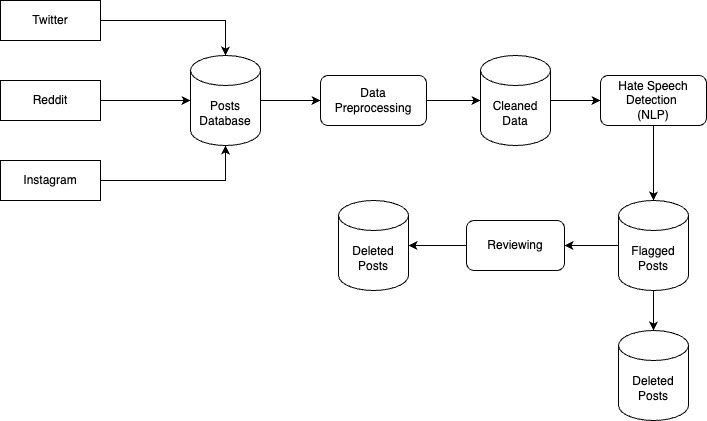

# PrideShield

**Multimodal detection of anti-LGBTQ+ hate speech in internet memes.**

Memes are a hard case for content moderation. The image alone is often benign, the overlaid text
alone is often benign, and the hostility exists only in their *combination* — which is precisely
where unimodal classifiers fail. PrideShield builds a multimodal classifier for this content
(**CLIP** visual + text embeddings → MLP head), benchmarks three vision encoders against each other
and against a text-only transformer baseline, and — just as importantly — documents the parts that
didn't work.

> **Status: archived research code (July 2024 – May 2025).** Built as an undergraduate major project
> at JUIT. Preserved as-is for reproducibility and reference.
> See **[Future Scope](#future-scope)** for how this would be built differently today.

---

## Table of Contents

- [The Research Story](#the-research-story)
- [Results](#results)
- [Architecture](#architecture)
- [Repository Structure](#repository-structure)
- [Pipeline](#pipeline)
- [Getting Started](#getting-started)
- [Dataset & Responsible Use](#dataset--responsible-use)
- [Limitations](#limitations)
- [Future Scope](#future-scope)
- [Citation](#citation)
- [License](#license)

---

## The Research Story

### The constraint that shaped everything: no budget

This project had **no funding for paid APIs, annotation services, or compute**. That single
constraint determined the shape of the work more than any modeling decision:

- **No paid API access** meant no Twitter/X firehose, no commercial moderation datasets, no
  GPT-assisted labeling. Data had to come from free tiers and public endpoints — Reddit's PRAW free
  tier, 4chan's public JSON API — supplemented by **Selenium-driven browser scraping** across
  DuckDuckGo, Bing, and Google Images, because image search has no free bulk API.
- **No annotation budget** meant **we labeled the dataset ourselves, by hand** — every meme read and
  judged by two people independently.
- **No dedicated compute** meant Google Colab's free tier, which ruled out fine-tuning the vision
  encoders and pushed us toward *frozen CLIP embeddings + a small trainable head* — a decision made
  for tractability first, and only justified on its merits afterward.

Most of the elapsed project time went into **data acquisition and annotation, not modeling.** That
is the honest shape of this work, and it is worth stating plainly because it is the shape of a lot
of applied ML.

### Building the dataset by hand

There was no off-the-shelf corpus of anti-LGBTQ+ memes, so we built one:

```
  4 scraping sources          ~1,700 raw images
  (Reddit, 4chan,      ──►    collected across                ──►  perceptual-hash
   DDG/Bing/Google)           multiple sessions                    deduplication
                                                                        │
                                                                        ▼
   1,320 final rows      ◄──  drop inter-annotator      ◄──   1,667 images dual-annotated
   (train/val/test)          disagreements                     by hand (2 annotators)
```

Every step here was a problem we hit rather than a step we planned:

- **Scrapers kept breaking.** Image search results are JavaScript-rendered, so simple HTTP scraping
  returned nothing — hence Selenium. Different sources needed different CSS selector strategies,
  and those selectors broke as pages changed.
- **Massive duplication across sources.** The same handful of viral memes appear on every platform.
  Naive collection produced a corpus that was mostly repeats, which would have leaked between
  train and test splits. Fixed with **perceptual-hash deduplication** (`imagededup`) —
  ~1,700 raw images collapsed to a genuinely distinct set.
- **Reverse image search for provenance.** Some images were reposts with modified captions; we used
  Selenium-driven reverse image search to check provenance where it mattered.
- **OCR was the biggest quality bottleneck.** Meme text is stylized, low-contrast, and often
  overlaid on busy backgrounds. EasyOCR output was frequently garbled — and since the caption is
  half the multimodal signal, bad OCR poisons the model. We layered two corrections on top: a
  **T5 model** for sequence-level correction, and **Levenshtein-distance spellchecking** for token
  repair. This mattered more to final performance than most architectural choices.
- **Annotation was slow and genuinely difficult.** Two annotators labeled independently. Agreement
  was far from perfect — the ambiguous cases are ambiguous *to humans*, which is the honest signal
  about the task's difficulty. We dropped disagreements rather than adjudicating them, which
  bought label precision at the cost of removing the hardest examples (see
  [Limitations](#limitations)).

### What we tried on the modeling side

**Text-only baseline first.** A DistilBERT/BERT-family transformer fine-tuned on a *public* English
hate-speech benchmark (FRENK, LGBT subset), attention/hidden dropout 0.2, HuggingFace `Trainer`.
This answered "how far does text alone get you?" → **~86.87%**.

**Then the multimodal pipeline.** For each meme: embed the image with CLIP's vision encoder, embed
the OCR caption with CLIP's text encoder, L2-normalize both, concatenate, and train an MLP head on
the fused vector.

**We benchmarked all three CLIP encoders** — not just the one that won — under identical downstream
conditions, which is what makes the comparison meaningful.

### What worked

- **The larger Vision Transformer, decisively.** `ViT-L/14@336px` reached **93.94%**, roughly
  **7 points above the text-only baseline** — evidence that the visual modality carries real signal
  for this content, which was the project's core hypothesis.
- **Focal Loss for class imbalance.** Implemented from scratch (the `(1 − p_t)^γ` down-weighting of
  easy examples). We did *not* assume it was better — we let the Optuna search choose between it
  and class-weighted CrossEntropy. It won for the ViT-L/14 configuration; class-weighted CE won for
  ViT-B/32. That split is itself informative: the right imbalance strategy depended on the encoder.
- **Automated hyperparameter search over hand-tuning.** A 30-trial **Optuna** study jointly tuned
  optimizer, learning rate, weight decay, dropout, activation, loss function, and MLP width/depth.
- **The OCR correction stack.** T5 + Levenshtein repair measurably improved the text half of the
  embedding, and was one of the highest-leverage interventions in the whole pipeline.

### What didn't work

Recording these honestly, because they're the more interesting half:

- **The CNN encoder lost badly — despite being the largest model.** `RN50x64` has ~336M parameters
  and the widest embedding (1024-d), yet scored **84.85%** — *below* `ViT-B/32` at ~88M parameters
  and 512 dimensions. More capacity did not mean better representations. For a task that depends on
  relating overlaid text to image semantics, the ViT's global attention appears to matter more than
  convolutional inductive bias or raw parameter count.
- **Simple concatenation is a weak fusion mechanism.** Concatenating two frozen embedding vectors
  cannot model *interaction* between modalities — which is exactly where meme hostility lives. It
  is early fusion in its crudest form. We knew this was a limitation and accepted it because
  training a real fusion module was out of reach on free-tier compute.
- **A transformer-over-tabular-features fusion variant was prototyped and abandoned.** It didn't
  outperform the plain MLP on a dataset this small; the extra capacity had nothing to learn from.
- **Deeper/regularized MLP variants gave no consistent gain.** BatchNorm variants, L2 + early
  stopping — all explored, none beat the Optuna-selected simple head.
- **CLIP's 77-token context limit is a real constraint.** Long meme captions exceed it. Our
  workaround — chunk the text and average the chunk embeddings — is informal and almost certainly
  loses information.
- **The dataset stayed small.** ~1,320 usable examples is not much for a nuanced classification
  task, and it bounds every conclusion here. Scaling was a labor problem, not a technical one.

### What we'd tell someone starting this today

Frozen-CLIP-plus-a-head was a defensible 2024 design under real constraints. It is not what we would
build now — see [Future Scope](#future-scope).

---

## Results

**Best configuration — CLIP `ViT-L/14@336px` → MLP head**, selected by Optuna
(AdamW, lr 0.01, weight decay 0, dropout 0.4, LeakyReLU, Focal Loss):

| Metric | Score |
|---|---|
| Accuracy | **93.94%** |
| Precision | 96.91% |
| Recall | 94.58% |
| F1 | 95.73% |
| ROC-AUC | 0.9030 |

**Vision encoder comparison** — all three run through the same downstream MLP and search procedure:

| Encoder | Embedding dim | Params | Peak accuracy | Relative compute |
|---|---|---|---|---|
| `ViT-B/32` | 512 | ~88M | 89.73% | Low |
| **`ViT-L/14@336px`** | 768 | ~307M | **93.94%** | High |
| `RN50x64` | 1024 | ~336M | 84.85% | Very high |

**Text-only baseline:** ~86.87%.

**Read these numbers alongside [Limitations](#limitations).** The dataset's class balance is
inverted relative to real moderation traffic (a majority-class baseline already scores ~80.9%),
precision/recall/F1 are positive-class rather than macro figures, and the text baseline was trained
on a *different, external* corpus — so the ~7-point multimodal gap is indicative, not a controlled
ablation.

## Architecture

<p align="center">
  
</p>

**Classifier head.** CLIP embeddings feed a compact MLP:

```
Linear(embed_dim, 256) → ReLU → Dropout(0.4)
    → Linear(256, 128) → ReLU → Dropout(0.4)
        → Linear(128, 2)
```

trained under either CrossEntropy or Focal Loss, with the choice made by the Optuna study rather
than fixed in advance.

Class, entity-relationship, and use-case diagrams are in [`docs/diagrams/`](docs/diagrams/)
(editable `.drawio` sources included).

## Repository Structure

```
PrideShield/
├── notebooks/
│   ├── 01_data_collection/     # multi-platform scraping
│   ├── 02_preprocessing/       # OCR, dedup, normalization, annotation merge
│   ├── 03_modeling/            # text baseline, CLIP+MLP models
│   └── utils/                  # shared data-wrangling helpers
├── docs/diagrams/              # DFD, class, ER, use-case (+ .drawio sources)
├── requirements.txt
├── CITATION.cff
├── LICENSE                     # Apache-2.0
└── NOTICE
```

## Pipeline

Notebooks are numbered in execution order within each stage.

### `01_data_collection/` — free-tier and browser-driven scraping
| Notebook | Purpose |
|---|---|
| `01_reddit_scraper_praw.ipynb` | Keyword-targeted collection from selected subreddits (PRAW free tier) |
| `02_reddit_scraper_async_praw.ipynb` | Async (`asyncpraw`) variant for higher throughput |
| `03_4chan_scraper.ipynb` | Thread/post/media collection via 4chan's public JSON API |
| `04_selenium_image_scraper.ipynb` | Selenium browser automation for JS-rendered image search |
| `05_google_images_scraper.ipynb` | Query-based supplementary image collection |

### `02_preprocessing/` — the quality-control layer
| Notebook | Purpose |
|---|---|
| `01_ocr_text_extraction.ipynb` | EasyOCR text extraction from meme images |
| `02_ocr_correction_t5.ipynb` | T5-based correction of garbled OCR output |
| `03_image_deduplication.ipynb` | Perceptual-hash deduplication (`imagededup`) |
| `04_reverse_image_search_validation.ipynb` | Reverse-image search for provenance checking |
| `05_integrate_supplementary_images.ipynb` | Merge supplementary images into the corpus |
| `06_merge_annotation_csvs.ipynb` | Reconcile the two annotators' independent label files |
| `07_text_normalization_spellcheck.ipynb` | Levenshtein/spellchecker repair of OCR text |

### `03_modeling/`
| Notebook | Purpose |
|---|---|
| `01_bert_text_baseline.ipynb` | Text-only transformer baseline (FRENK-LGBT benchmark) |
| `02_bert_finetuning_v1.ipynb` | Further fine-tuning experiments on the text model |
| `03_clip_mlp_v1.ipynb` | First CLIP-embedding + MLP multimodal model |
| `04_clip_mlp_optuna_final.ipynb` | **Final model** — Optuna search, Focal Loss, encoder comparison |
| `05_multimodal_architecture_experiments.ipynb` | Alternative fusion architectures (incl. the abandoned tabular-transformer variant) |

## Getting Started

```bash
git clone https://github.com/Vermillion-1/PrideShield.git
cd PrideShield
python -m venv .venv && source .venv/bin/activate
pip install -r requirements.txt
```

Notebooks were developed in Google Colab and contain Colab-specific paths (`/content/…`, Drive
mounts); adjust for local execution. Scrapers require your own API credentials (Reddit app
credentials for PRAW) — never commit them; `.gitignore` covers `praw.ini` and `.env`.

Notebook outputs are intentionally stripped (see below).

## Dataset & Responsible Use

**The dataset is not distributed in this repository, and notebook outputs have been cleared.**

This is deliberate. The corpus consists of scraped hate speech targeting a marginalized community.
Publishing it — or rendered notebook outputs containing it — would redistribute that material to
anyone browsing the repo, and would conflict with the source platforms' terms of service. The code
is public; the harmful content is not.

Researchers with a legitimate use may contact the author to discuss access.

**If you build on this work:** treat the classifier as a *triage aid*, not an adjudicator. False
positives on reclaimed in-group language are a known and serious failure mode for this class of
model, and the cost of silencing the community you intend to protect is not symmetric with the cost
of missing a slur.

## Limitations

Stated plainly, because they bound what the results mean:

- **Class balance is inverted relative to deployment.** The dataset is ~80.9% / 19.1%, whereas real
  moderation traffic is overwhelmingly benign. A majority-class baseline scores ~80.9% here, so
  headline accuracy overstates practical utility — minority-class precision/recall are the
  informative metrics.
- **Reported precision/recall/F1 are positive-class, not macro.** Macro-averaged figures are lower.
- **The text baseline is not a clean ablation.** It was trained on an external public benchmark
  (FRENK-LGBT), not on the meme corpus, so "multimodal beats text-only" is not a controlled
  comparison on identical data.
- **Small evaluation set.** ~1,320 labeled examples; differences between CLIP encoders are point
  estimates without confidence intervals and may not be statistically separable.
- **Annotator disagreements were dropped, not adjudicated**, removing the hardest cases and likely
  inflating all reported metrics relative to real-world difficulty.
- **Two annotators, both project members.** No external validation, and no inter-annotator
  agreement statistic (e.g. Cohen's κ) was computed — it should have been.
- **Single-run results.** No multi-seed variance reporting, no k-fold cross-validation.
- **No fairness or adversarial-robustness evaluation** — a real gap for a moderation system.
- **English-only**, scoped to a narrow slice of platforms and time.

## Future Scope

This is 2024-era multimodal tooling. CLIP-embeddings-plus-a-head was reasonable then; it is no
longer the obvious choice. If restarted today:

**1. Benchmark against modern vision-language models first.**
Instruction-tuned VLMs (LLaVA, Qwen-VL, InternVL, or a frontier multimodal API) can be evaluated
zero-shot or few-shot with no training at all. That is the baseline any new work must beat — and it
may beat the CLIP+MLP pipeline outright. A modern version should *start* there.

**2. Replace concatenation with real fusion.**
Cross-attention between modalities, or a VLM attending jointly over image and text natively, can
model the image-text *interaction* that carries the hostility — the exact signal concatenation
cannot represent.

**3. Exploit VLM reasoning for explainability.**
A VLM can be prompted to *explain why* a meme is hateful, producing a rationale a human moderator
can audit — far more useful operationally than a scalar score.

**4. Use VLMs to break the annotation bottleneck.**
The binding constraint here was human labeling capacity. Modern VLMs can pre-label at scale with
humans adjudicating only low-confidence cases — the same corpus effort could plausibly yield an
order of magnitude more data.

**5. Fix the evaluation methodology.**
The most important upgrades aren't architectural: a like-for-like text-vs-multimodal ablation on
identical data; k-fold CV with confidence intervals; macro-averaged metrics; multi-seed runs;
adjudicated (not dropped) disagreements with a reported κ; and a test set reflecting realistic
class balance.

**6. Add fairness and robustness evaluation.**
Measure false-positive rates on reclaimed in-group language, and test robustness to adversarial
evasion (character substitution, text-in-image obfuscation, crops).

**7. Track experiments properly.**
W&B or MLflow with configuration-driven sweeps, so results are queryable rather than living in
notebook cell outputs.

## Citation

If you use this work, please cite it (GitHub's *"Cite this repository"* button reads
[`CITATION.cff`](CITATION.cff)):

```bibtex
@software{singh_prideshield_2025,
  author  = {Singh, Ankush},
  title   = {{PrideShield: Multimodal Detection of Anti-LGBTQ+ Hate Speech in Memes}},
  year    = {2025},
  url     = {https://github.com/Vermillion-1/PrideShield},
  license = {Apache-2.0}
}
```

## Acknowledgements

Developed by **Ankush Singh** (primary author — data pipeline, preprocessing, modeling,
experimentation). Submitted as an undergraduate major project at Jaypee University of Information
Technology under Prof. Dr. Vivek Kumar Sehgal and Dr. Kushal Kanwar; **Arpan Chauhan** and
**Shubh Saxena** are credited as project collaborators on the academic submission.

## License

Licensed under the **Apache License 2.0** — see [`LICENSE`](LICENSE) and [`NOTICE`](NOTICE).
You may use, modify, and distribute this work, including commercially, provided you retain
attribution and the license notice.

---

**Contact:** Ankush Singh — ankush.singh1802@gmail.com
